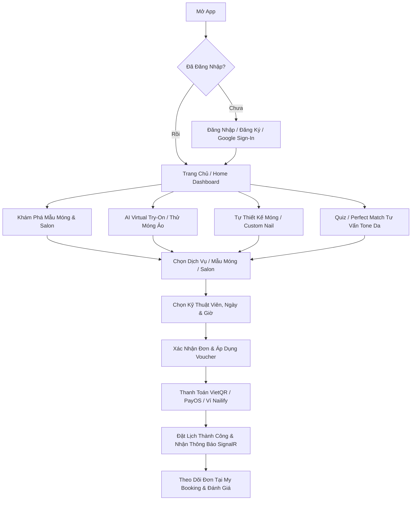

# Nailify Mobile - Nền Tảng Đặt Lịch Làm Móng & Thử Móng Ảo AI

<p align="center">
  <b>Nailify</b> là ứng dụng di động thông minh dành cho ngành làm móng (Nail Art), tích hợp công nghệ <b>AI Virtual Try-On</b> thử móng ảo theo thời gian thực và hệ sinh thái đặt lịch làm đẹp, cá nhân hóa thiết kế móng, quản lý salon & ví điện tử tiện lợi.
</p>

---

## Mục lục

- [Tính Năng Nổi Bật](#tính-năng-nổi-bật)
- [Kiến Trúc Dự Án (Architecture)](#kiến-trúc-dự-án-architecture)
- [Công Nghệ & Thư Viện Sử Dụng](#công-nghệ--thư-viện-sử-dụng)
- [Cấu Trúc Thư Mục (Folder Structure)](#cấu-trúc-thư-mục-folder-structure)
- [Hướng Dẫn Cài Đặt & Chạy Ứng Dụng](#hướng-dẫn-cài-đặt--chạy-ứng-dụng)
- [Cấu Hình Môi Trường & API](#cấu-hình-môi-trường--api)
- [Đa Ngôn Ngữ (Localization)](#đa-ngôn-ngữ-localization)
- [Các Luồng Người Dùng Chính](#các-luồng-người-dùng-chính)

---

## Tính Năng Nổi Bật

### 1. Thử Móng Ảo AI (Virtual Try-On)
- **Real-time Camera Try-On & Snapshot Try-On**: Tự động nhận diện bàn tay, khớp mẫu móng theo từng ngón tay với độ chính xác cao.
- **AI On-Device**: Xử lý mô hình thị giác máy tính với **ONNX Runtime** và **Hand Landmarker** trên luồng riêng biệt (*Isolate/Multithreading*), đảm bảo hiệu năng mượt mà.

### 2. Tự Thiết Kế Móng & Studio Cá Nhân (Custom Nail & My Studio)
- **Nail Composition Design**: Tùy chỉnh chi tiết từng móng (ngón cái, trỏ, giữa, áp út, út) với dáng móng, bảng màu sắc, họa tiết và charm đính kèm.
- **My Studio**: Lưu trữ các bộ móng yêu thích, mẫu tự thiết kế hoặc mẫu đã thử ảo để dễ dàng đặt lịch làm thực tế.

### 3. Hệ Thống Đặt Lịch Toàn Diện (Nail & Service Booking)
- **Đa dạng hình thức đặt lịch**:
  - Đặt lịch theo mẫu móng có sẵn (Nail Booking).
  - Đặt lịch theo dịch vụ chăm sóc móng (Service Booking).
  - Đặt lịch theo mẫu tự thiết kế cá nhân (Custom Nail Booking).
  - Đặt lịch bảo hành móng (Warranty Booking).
- **Lựa chọn linh hoạt**: Chọn Salon gần nhất, kỹ thuật viên (Nail Artist) yêu thích, khung giờ phù hợp và ghi chú yêu cầu.
- **Quản lý đơn hẹn**: Theo dõi tiến trình đơn (Pending, Confirmed, Completed, Cancelled), huỷ/đổi lịch và đánh giá (Rating/Review).

### 4. Gợi Ý Mẫu Móng Cá Nhân Hóa (Quiz & Perfect Match)
- Làm bài trắc nghiệm ngắn (Quiz) về phong cách, sở thích và tone da để hệ thống tự động phân tích và gợi ý các mẫu móng phù hợp nhất.

### 5. Ví Điện Tử & Thanh Toán Tiện Lợi (Wallet & Payments)
- Thanh toán linh hoạt qua mã **VietQR / PayOS / VNPay**.
- Quản lý số dư ví Nailify, nạp tiền, yêu cầu rút tiền về tài khoản ngân hàng.
- Tích điểm thưởng thành viên, đổi voucher ưu đãi và áp dụng mã giảm giá khi đặt lịch.

### 6. Real-Time & Thông Báo Đẩy (Real-time Updates)
- Kết nối **SignalR Hub** cập nhật tức thời trạng thái lịch hẹn và biến động số dư.
- Tích hợp **Firebase Cloud Messaging (FCM)** và **Local Notifications** thông báo nhắc lịch làm móng.

---

## Kiến Trúc Dự Án (Architecture)

Dự án được xây dựng theo mô hình **Feature-Driven Architecture** kết hợp nguyên lý **Clean Architecture**:

```
lib/
├── core/                # Các thành phần cốt lõi dùng chung (Constants, Network, Theme, Utils, Di...)
├── features/            # Các module chức năng độc lập (Feature-Driven)
│   ├── auth/            # Xác thực, đăng nhập, đăng ký, OTP
│   ├── home/            # Trang chủ, banner, gợi ý
│   ├── discover/        # Khám phá mẫu nail & tìm kiếm
│   ├── nails/           # Chi tiết mẫu nail, danh mục, biến thể
│   ├── custom_nail/     # Công cụ thiết kế móng tùy biến
│   ├── my_studio/       # Bộ sưu tập nail cá nhân
│   ├── try-on/          # Tính năng AI Virtual Try-On
│   ├── salon/           # Danh sách salon, bản đồ & thợ nail
│   ├── services/        # Dịch vụ chăm sóc móng
│   ├── nail_booking/    # Luồng đặt lịch & thanh toán QR
│   ├── my_booking/      # Quản lý & đánh giá lịch hẹn
│   ├── perfect_match/   # Gợi ý phối móng thông minh
│   ├── quiz/            # Phân tích tone da & trắc nghiệm phong cách
│   ├── wallet/          # Ví điện tử, voucher & điểm thưởng
│   └── profile/         # Hồ sơ cá nhân & cài đặt
├── generated/           # Code tự động sinh (L10n)
└── l10n/                # Tệp dịch đa ngôn ngữ (.arb)
```

Mỗi feature tuân thủ cấu trúc phân tầng rõ ràng:
- **`data/`**: Models, Data Sources (API Service), Repositories Implementation.
- **`domain/`** (hoặc Logic layer): Logic nghiệp vụ, Entities (nếu có).
- **`presentation/`**: Pages, Widgets, BLoC / Cubit State Management.

---

## Công Nghệ & Thư Viện Sử Dụng

| Danh Mục | Công Nghệ / Thư Viện |
| :--- | :--- |
| **Framework** | Flutter (Dart SDK `^3.11.1`) |
| **State Management** | `flutter_bloc`, `cubit`, `equatable`, `provider` |
| **Navigation / Routing** | `go_router` |
| **Networking & HTTP** | `dio`, `pretty_dio_logger`, `connectivity_plus` |
| **Real-Time Hub** | `signalr_netcore` |
| **Push Notifications** | `firebase_core`, `firebase_messaging`, `flutter_local_notifications` |
| **AI / Machine Learning** | `onnxruntime`, `camera`, `hand_landmarker`, `image` |
| **Maps & Location** | `flutter_map`, `latlong2` |
| **Dependency Injection** | `get_it` |
| **Local Storage** | `shared_preferences` |
| **Auth & Social Login** | REST API JWT Token + `google_sign_in` |
| **Payments & Utilities** | `qr_flutter`, `url_launcher`, `image_picker`, `permission_handler` |
| **Localization** | `flutter_localizations`, `intl` |

---

## Cấu Trúc Thư Mục (Folder Structure)

```
Nailify_Mobile_Flutter/
├── android/                    # Mã nguồn Native Android & cấu hình Google Services
├── ios/                        # Mã nguồn Native iOS
├── assets/
│   ├── icons/                  # Các icon SVG, PNG
│   ├── images/                 # Hình ảnh minh họa, banner
│   └── models/                 # AI ONNX models (ar.onnx, best.onnx, thanhdtPose.onnx)
├── lib/
│   ├── core/
│   │   ├── constants/          # AppConstants, API URLs, Colors, Dimensions
│   │   ├── di/                 # Dependency Injection (GetIt)
│   │   ├── error/              # Xử lý ngoại lệ, Failures
│   │   ├── localization/       # Quản lý LocaleService
│   │   ├── network/            # DioClient, Interceptors, SignalRService
│   │   ├── routing/            # AppRouter (GoRouter setup)
│   │   ├── theme/              # LightTheme, DarkTheme, AppStyles
│   │   ├── utils/              # TokenUtils, Formatters, Helpers
│   │   └── widgets/            # CustomButton, AppTextField, LoadingDialog...
│   ├── features/               # 16 module tính năng (Xem mô tả ở trên)
│   ├── generated/              # Auto-generated code cho Localization
│   ├── l10n/                   # intl_vi.arb, intl_en.arb
│   └── main.dart               # Entry point của ứng dụng
├── pubspec.yaml                # Khai báo dependencies và assets
└── README.md
```

---

## Hướng Dẫn Cài Đặt & Chạy Ứng Dụng

### 1. Yêu Cầu Môi Trường
- **Flutter SDK**: `>= 3.11.1` (Khuyến nghị Flutter 3.24+ / Dart 3.5+)
- **Android Studio / VS Code** (đã cài Flutter & Dart plugin)
- **JDK**: Java 17+
- **Android Device / Emulator**: Android 7.0 (API level 24) trở lên (khuyến nghị thiết bị thật có Camera để trải nghiệm AR Try-On tốt nhất).

### 2. Các Bước Cài Đặt

1. **Clone repository về máy**:
   ```bash
   git clone https://github.com/YourOrganization/Nailify_Mobile_Flutter.git
   cd Nailify_Mobile_Flutter
   ```

2. **Cài đặt các dependencies**:
   ```bash
   flutter pub get
   ```

3. **Sinh mã đa ngôn ngữ (Localization)**:
   ```bash
   flutter gen-l10n
   ```

4. **Kiểm tra thiết bị kết nối**:
   ```bash
   flutter devices
   ```

5. **Chạy ứng dụng**:
   - Chế độ Debug:
     ```bash
     flutter run
     ```
   - Chế độ Profile / Release (tối ưu hóa tốc độ AI Try-On):
     ```bash
     flutter run --release
     ```

---

## Cấu Hình Môi Trường & API

Endpoint API mặc định được cấu hình trong `lib/core/constants/app_constants.dart`:

```dart
class AppConstants {
  static const String appName = 'Mo Nailify Project';
  
  // Production API (Azure App Services)
  static const String baseUrl = 'https://nailify-api-dngpb5e9d6dcbydz.southeastasia-01.azurewebsites.net/';
  
  // Local Android Emulator API (Nếu debug backend localhost):
  // static const String baseUrl = 'http://10.0.2.2:5004';
  
  static const String apiVersion = '/api';
  static const String authTokenKey = 'auth_token';
  static const Duration connectTimeout = Duration(seconds: 60);
  static const Duration receiveTimeout = Duration(seconds: 60);
}
```

> **Lưu ý**: Đối với tính năng đăng nhập Google (`google_sign_in`) và thông báo đẩy Firebase (`firebase_messaging`), cần đảm bảo tệp cấu hình `android/app/google-services.json` đã được đặt đúng vị trí.

---

## Đa Ngôn Ngữ (Localization)

Ứng dụng hỗ trợ 2 ngôn ngữ:
- **Tiếng Việt** (`lib/l10n/intl_vi.arb`)
- **Tiếng Anh** (`lib/l10n/intl_en.arb`)

Khi thêm mới hoặc chỉnh sửa chuỗi dịch trong file `.arb`, chạy lệnh sau để cập nhật:
```bash
flutter gen-l10n
```

---

## Các Luồng Người Dùng Chính



---

## Đội Ngũ Phát Triển (Team & Contact)

- **Dự Án**: Nailify Capstone Project
- **Phiên Bản**: 1.0.12

---
<p align="center">Nailify Development Team</p>
